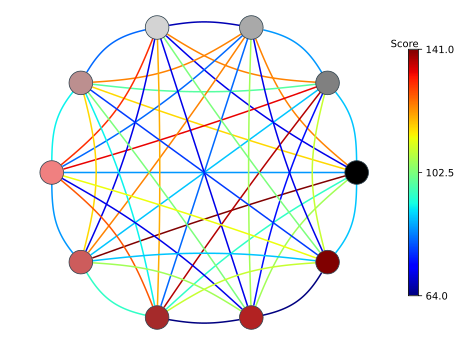
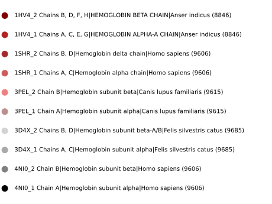

# Generate a similarity network graph from sequences in 'fasta' format. 

## Description

This script allows you to align two by two of all the sequences contained in a fasta file '<test2>.fasta'.
The output is a network graph representing  sequences as nodes connected by edges with a color representing the alignment score.

## Setup

To use the python file 'TP1_languages_script.py' you must first check that all packages are installed on your machine.
To do this, run :

```
./setup.sh
```
## Example of use

To test the operation of the script you have two test sets available :

    * test.fasta
    * test2.fasta.

To run the script with the default settings run :

```
./TP1_languages_script.py test2.fasta
```

> Result :




To print the help run :

```
./TP1_languages_script.py  -h
usage: TP1_languages_script.py [-h] [--edge_label bool] [--node_label bool]
                               [--threshold float]
                               Path_to_file

This script allows you to perform a two by two alignment of all sequences
contained in a fasta file. The output is a network graph representing the
sequences as nodes connected by edges with a color representing the alignment
score.

positional arguments:
  Path_to_file       Fasta file for alignement : .fasta or .fa

options:
  -h, --help         show this help message and exit
  --edge_label bool  Draw edge label or not
  --node_label bool  Draw node label or not
  --threshold float  Set a threshold for drawing edges that have a label >=
                     threshold
```

> N.B.: If the fasta file contains more than 48 sequences, the --node_label parameter will be automatically set to True. If this is the case, pay attention to the length of the sequences header: only the first 6 characters after the '>' will be printed.